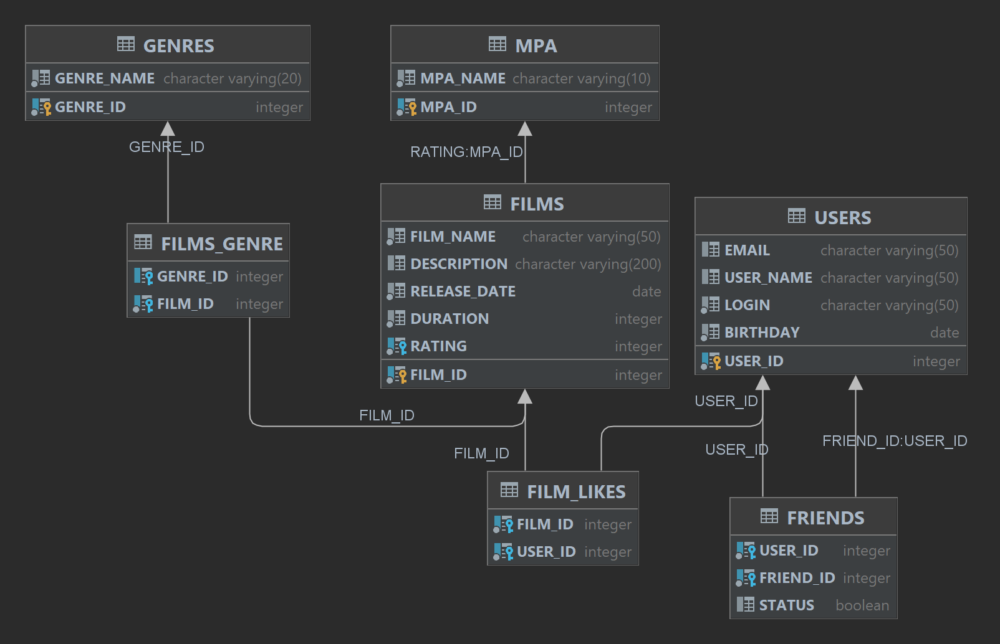

Репозиторий проекта Filmorate

Схема базы данных 

<picture>
    <source media="(prefers-color-scheme: dark)" srcset="src/main/resources/Diagram.png">
    
</picture>

Примеры основных запросов
select * from USERS where USER_ID = ?

select USER_ID, EMAIL, USER_NAME, LOGIN, BIRTHDAY from USERS

insert into USERS (EMAIL, USER_NAME, LOGIN, BIRTHDAY) values (?, ?, ?, ?)";

update USERS set EMAIL = ?, USER_NAME = ?, LOGIN = ?, BIRTHDAY = ? where USER_ID = ?";

delete from USERS where USER_ID = ?

insert into FRIENDS (USER_ID, FRIEND_ID, STATUS) values (?, ?, ?)

delete from FRIENDS where USER_ID = ? and FRIEND_ID = ?

select FRIEND_ID from FRIENDS where USER_ID = ?

select FILM_ID, FILM_NAME, DESCRIPTION, RELEASE_DATE, DURATION from FILMS where FILM_ID = ?

select * from FILMS

insert into FILMS (FILM_NAME, DESCRIPTION, RELEASE_DATE, DURATION, RATING) values (?, ?, ?, ?, ?)
insert into FILMS_GENRE (FILM_ID, GENRE_ID) values (?, ?)

update FILMS set FILM_NAME = ?, DESCRIPTION = ?, RELEASE_DATE = ?, DURATION = ?, RATING = ? where FILM_ID = ?
delete from FILMS_GENRE where FILM_ID = ?
insert into FILMS_GENRE (FILM_ID, GENRE_ID) VALUES (?, ?)
select * from FILMS_GENRE where FILM_ID = ? AND GENRE_ID = ?

insert into FILM_LIKES (FILM_ID, USER_ID) values (?, ?)

delete from FILM_LIKES where FILM_ID = ? and USER_ID = ?

delete from FILMS where FILM_ID = ?

select GENRES.GENRE_ID, GENRE_NAME from GENRES join FILMS_GENRE FG on GENRES.GENRE_ID = FG.GENRE_ID where FILM_ID = ?

select MPA_ID, MPA_NAME from MPA join FILMS F ON MPA.MPA_ID = F.RATING where film_id = ?

select USER_ID from FILM_LIKES where FILM_ID = ?

select * from GENRES

select * from GENRES where GENRE_ID = ?

select * from MPA

select * from MPA where MPA_ID = ?